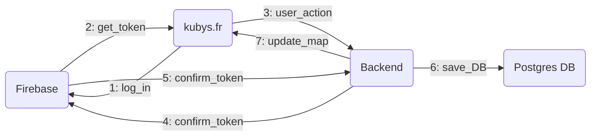

# Welcome to Kubys project

I am happy to see you here !

If all you want is playing, just click [here](https://kubys.fr) and you will be redirect to the game.

If you want to help the develop team, do not be shy and do not hesitate to ask questions, we are looking for little hands as well as experimented developers, 3D experts and game designers.

## I want to help, what can I do ?

First, you can send me a message and ask what you can do or what you want to do.
Secondly, you can travel around the code and search for code smells or improvements.
Thirdly, you can make pull requests in order to share your improvements with the community.

## Where could I find the code ?

For the **backend**, just go [here](https://github.com/Joalien/Kubys/tree/master/backend)
For the **frontend**, just go [here](https://github.com/Joalien/Kubys/tree/master/front)

## Are you looking for people who can optimize the integration pipeline ?
**Yes**

## I do not know how/want to write code, can I help anyway ?

**Yes**, we have a lot of work to do in order to find spells and weapons name, balance the different breed or to give us ideas about how to plant trees.

## How does the architecture look like ?

Each client communicates with single server (no load balancer yet). 
Client are  embedded inside the browser, no need to install anything.



## I want to make the project run on my computer, how can I achieve this ?
Build front with : ```npm run build-dev && rsync -avzc resources dist/```  
Build back  
Change the websocket url in Communication.js  
And finally run ```docker-compose -f docker-compose.dev.yml up --build --force-recreate```